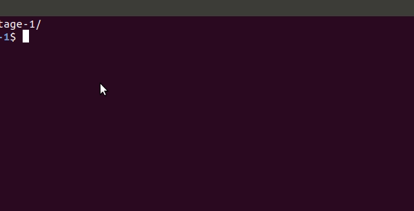

# Restaurant Review App

This is an assessment project for a [Front-End Nanodegree](https://www.udacity.com/course/front-end-web-developer-nanodegree--nd001) program.<br>
This project is a revamp of bad designed and not responsive app.<br>
After revamp Restaurant Review app is a progressive web app with<br>
Offline first implementation. As well it has a responsive design and<br>
works on any device

## Key Features

* Supports Offline first
* Responsive design

## How To Use

To clone the app using SSH:

```bash
$ git clone git@github.com:VolodymyrPliuta/Restaurant-Reviews-app.git

# Go into the repository
$ cd Restaurant-Reviews-app

# Run python server
$ python3 -m http.server 8000
```


```
# Run the app in the browser, type in address bar
$ localhost:8000 
```
